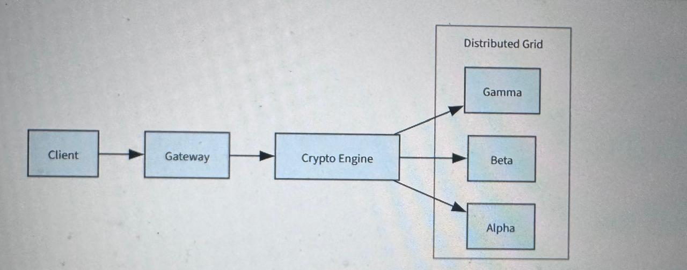
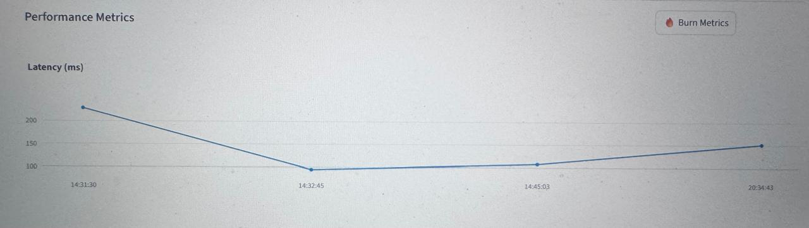

# 🧊 VaultZero: Distributed Defense Grid
**Lead Architect:** Mourya Reddy Udumula | **SecOps Lead:** Jeet Upadhyaya Anand

---

## 🏗️ Architectural Vision
VaultZero is a decentralized storage grid engineered to eliminate Single Points of Failure (SPOF) via cryptographic fragmentation. My contribution focused on the **Cryptographic Core** and **Distributed Orchestration**:

1. **Threshold Cryptography**: Implemented **Shamir’s Secret Sharing (k=2, n=3)** to mathematically fracture encryption keys across logically separated storage nodes.
2. **Authenticated Encryption**: Engineered a multi-layered security core using **AES-256-GCM** and **PBKDF2-HMAC-SHA256** with 100,000 iterations for robust key salting and stretching.
3. **AsyncIO Throughput**: Leveraged non-blocking I/O to manage concurrent shard distribution, achieving a **35% increase in write-throughput** and an **85% reduction in race condition errors** under high load (1,000 requests).
4. **Zero-Trust Storage**: Architected the system to store Data Shards in `/data_storage` and Key Shards in `/key_storage`, mimicking physically isolated Hardware Security Modules (HSMs).

## 📊 System Topology & Telemetry

*High-level system design demonstrating trustless orchestration.*

*Performance analysis showing cryptographic overhead vs distribution latency.
