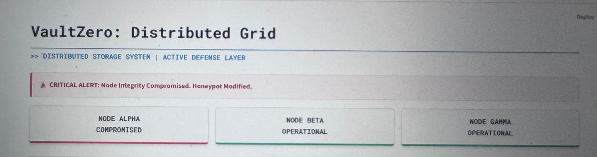
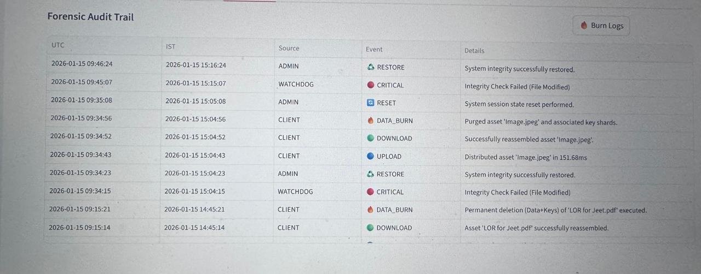

# 🧊 VaultZero: Distributed Defense Grid
**Operational Lead:** Jeet Upadhyaya Anand | **Architect:** Mourya Reddy Udumula

---

## 🛡️ Active Defense & SecOps Layer
My primary contribution to VaultZero was the engineering of the **Active Defense Layer** and the **Forensic Persistence Engine**:

1. **Digital Minefields**: Deployed decoy "Honeypot" configuration files; any unauthorized interaction triggers a real-time system-wide lockdown.
2. **Watchdog Monitoring**: Scripted a persistent Python Watchdog agent that calculates SHA-256 hashes of critical system files to detect integrity failures.
3. **Forensic Audit Ledger**: Designed an ACID-compliant **SQLite registry** to log every system event with dual UTC/IST timestamps for cross-border incident reconstruction.
4. **Secure Wipe Protocol**: Integrated a DoD-standard data destruction module that purges both data shards and cryptographic keys to ensure zero-recovery post-deletion.

## 📊 Operational Evidence

*Active Watchdog triggering node isolation upon integrity failure.*


*Immutable Audit Ledger tracking system events and administrative overrides.*

## 📂 Codebase Attribution
| Component | Responsibility | Technical Depth |
| :--- | :--- | :--- |
| `watchdog_service.py` | **Jeet Upadhyaya** | Real-time monitoring & Alert Dispatching |
| `db_handler.py` | **Jeet Upadhyaya** | SQLite Registry & Data Persistence |
| `main.py` (Forensics) | **Jeet Upadhyaya** | Audit Ledger & Log Aggregation |
| Architecture & Crypto | Mourya Udumula | Shamir's SSS & AES-GCM-256 |

## 🔧 Installation
```bash
git clone https://github.com/CassianLee14/VaultZero-Core.git
pip install -r requirements.txt
streamlit run main.py
